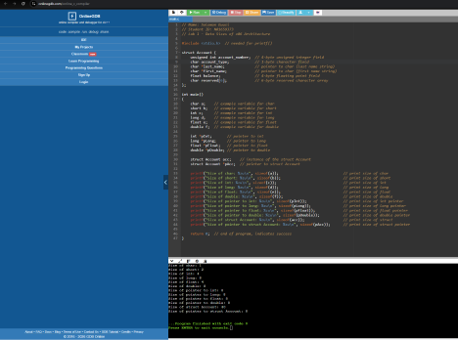
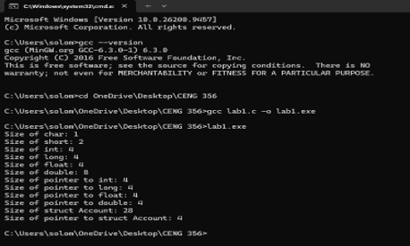

# CENG 356 - Lab 1: Data Sizes of x86 Architecture

**Student:** Solomon Ewusi
**Student ID:** n01659373
**Course:** CENG 356 - Computer Systems Architecture
**Institution:** Humber College

---

## Overview

This lab uses the `sizeof` operator in C to determine the sizes of the main C data types, pointers to those types, and a custom `struct Account`, on two different platforms: onlinegdb.com (online compiler) and a local PC (MinGW GCC).

---

## Files

| File | Description |
|------|-------------|
| `lab1.c` | Source code that declares each data type/pointer/struct and prints their sizes |

---

## Features Implemented

### 1. Basic Data Type Sizes
- Declares one variable each of `char`, `short`, `int`, `long`, `float`, `double`
- Prints the size of each using `sizeof()`

### 2. Pointer Sizes
- Declares pointers to `int`, `long`, `float`, `double`
- Prints the size of each pointer type

### 3. Struct Account
- Defines `struct Account` with `account_number`, `account_type`, `last_name`, `first_name`, `balance`, and `reserved[6]`
- Prints the size of a struct instance and a pointer to the struct

---

## How to Compile & Run

### Requirements
- GCC (MinGW for Windows) or any standard C compiler

### Compile
```
gcc lab1.c -o lab1.exe
```

### Run
```
lab1.exe
```

---

## Results Comparison

| Data Type | onlinegdb.com (64-bit) | Local PC (32-bit MinGW) |
|---|---|---|
| char | 1 | 1 |
| short | 2 | 2 |
| int | 4 | 4 |
| long | 8 | 4 |
| float | 4 | 4 |
| double | 8 | 8 |
| pointer to int | 8 | 4 |
| pointer to long | 8 | 4 |
| pointer to float | 8 | 4 |
| pointer to double | 8 | 4 |
| struct Account | 40 | 28 |
| pointer to struct Account | 8 | 4 |

---

## Screenshots

### Running results on onlinegdb.com (64-bit environment)


### Running results on local PC (32-bit MinGW environment)


---

## Notes

- `long` and all pointer types are 8 bytes on the 64-bit onlinegdb.com environment, but only 4 bytes on the 32-bit local MinGW environment — this is expected, since pointer and `long` sizes are implementation-specific and depend on the target architecture.
- `char`, `short`, `int`, `float`, and `double` stay the same size on both platforms since the C standard fixes minimum sizes for these types.
- The `struct Account` size is larger than the simple sum of its fields due to memory alignment/padding added by the compiler around the pointer fields.
